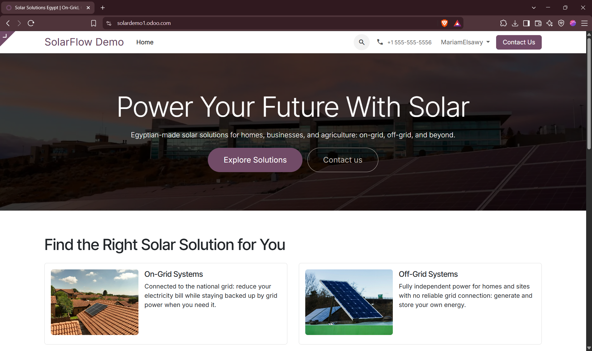
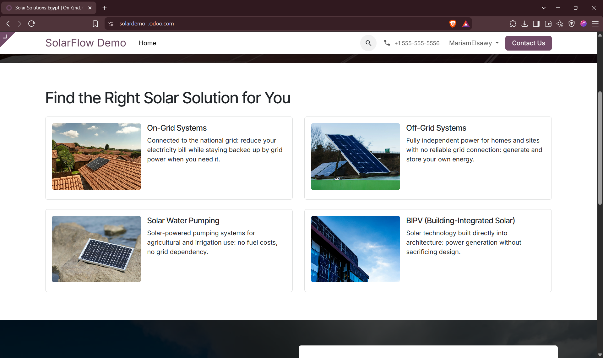
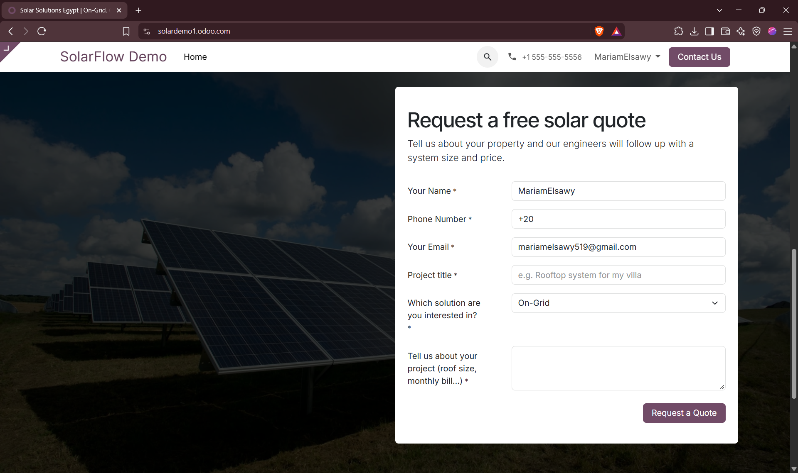
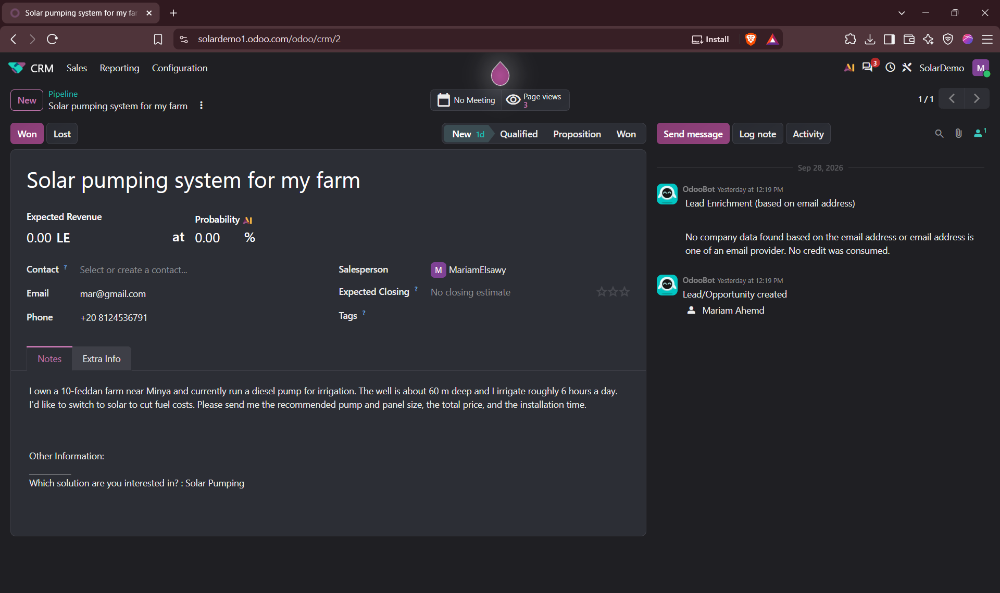
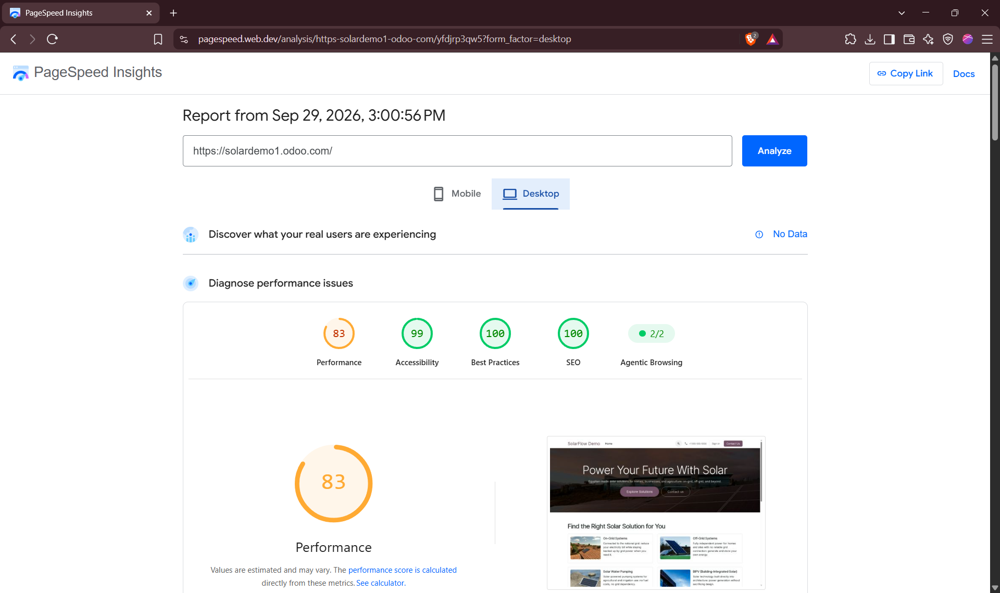

# Solar Solutions Website & Quote Portal (Odoo)

A demo landing page and lead-capture system built in Odoo's Website Builder,
created while learning Odoo for an Odoo Website Developer job application.
Not affiliated with any real company — solar industry categories (on-grid,
off-grid, solar water pumping, BIPV) are used as realistic content for
demonstration purposes.

## What it does

- A responsive landing page introducing four solar solution categories
- A quote-request form that automatically creates and assigns a lead in
  Odoo's CRM when submitted — no custom backend code required
- SEO metadata (title, description, image alt text) and a mobile
  performance pass using Google PageSpeed Insights

## What I built and learned

- **Odoo Website Builder**: hero section, image backgrounds with color
  overlays for text contrast, a 2x2 card grid, and a contact form block
- **XML / QWeb templating**: edited the homepage's underlying HTML/XML
  directly through Odoo's HTML/CSS Editor — including restructuring the
  card layout (image-left, text-right) beyond what the drag-and-drop
  builder alone provides
- **Odoo CRM integration**: configured the form's submit action to create
  an Opportunity, added a custom "Selection" field (solution type dropdown),
  and assigned new leads to a salesperson
- **SEO & performance**: set page title/meta description, added image alt
  text, and used PageSpeed Insights to identify and reduce an image-loading
  bottleneck on mobile

## Screenshots

| Desktop hero | Solution cards |
|---|---|
|  |  |

| Mobile view | Quote form |
|---|---|
|  |  |

| CRM lead created from form submission |
|---|
|  |

| PageSpeed Insights (desktop) |
|---|
|  |

## Code

[`jet_solar_homepage.xml`](jet_solar_homepage.xml) — the homepage body
template (hero + solution cards) as edited directly in Odoo's code editor.

## Tech

Odoo Website Builder, QWeb/XML, HTML/CSS, Odoo CRM, Google PageSpeed Insights
